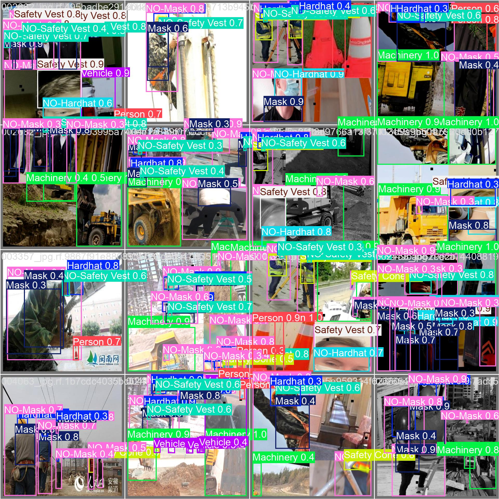

# PPE Detection System - Construction Site Safety


> An AI-powered computer vision system for automated workplace safety monitoring


*Sample detection showing PPE compliance monitoring on construction site*

---

## Team Members

**DeMarcus Crump**
- Role: Model Training & Optimization
- Contributions: Dataset preprocessing, YOLOv8 training pipeline, hyperparameter tuning, performance evaluation

**Chloe Tu**
- Role: Data Analysis & Deployment
- Contributions: Data exploration, visualization, demo implementation, documentation, deployment strategy

---

## Project Tier

**Tier 2 Project** (Medium Difficulty)

**Justification:**
- Uses advanced object detection (YOLOv8) beyond basic classification
- Implements multi-class detection (10 classes) with both positive and negative cases
- Requires understanding of stratified data splitting, advanced augmentation techniques
- Involves training from pretrained weights with custom dataset
- Achieves production-ready performance (77.1% mAP@50, 66 FPS)
- Goes beyond tutorial implementation with custom evaluation metrics and safety compliance analysis

---

## Problem & Solution

### The Problem
Construction sites have high injury rates due to PPE non-compliance. Manual safety inspections are slow, inconsistent, and cannot cover all workers continuously. This leads to undetected violations and preventable workplace accidents.

### Our Solution
An automated computer vision system using YOLOv8 that detects PPE compliance in real-time. The system identifies whether workers are wearing required safety equipment (hardhats, vests, masks) and flags violations instantly, enabling proactive safety monitoring at scale.

### Impact
- **Construction Site Managers**: Monitor hundreds of workers simultaneously with automated alerts
- **Safety Officers**: Focus on high-risk areas identified by the system rather than manual patrols
- **Workers**: Increased safety through consistent enforcement and immediate feedback
- **Companies**: Reduced injury rates, lower insurance costs, OSHA compliance improvement

---

## Technical Details

**Task Type**: Object Detection  
**Model**: YOLOv8s (Small variant)  
**Framework**: PyTorch via Ultralytics  
**Training Platform**: Google Colab (Tesla T4 GPU)

**Key Libraries:**
- `ultralytics` - YOLOv8 implementation
- `opencv-python` - Image processing
- `torch` - Deep learning framework
- `scikit-learn` - Stratified splitting
- `matplotlib` / `seaborn` - Visualization

---

## System Architecture

```
Input Image/Video
      |
      v
[Preprocessing]
- Resize to 640x640
- Normalize pixel values
      |
      v
[YOLOv8s Model]
- Backbone: CSPDarknet
- Neck: PAN
- Head: Detection head
      |
      v
[Post-processing]
- NMS (Non-max suppression)
- Confidence filtering (>0.35)
- Class-wise filtering
      |
      v
[Safety Analysis]
- Detect PPE violations
- Calculate compliance score
- Generate alerts
      |
      v
Output: Annotated image with bounding boxes + compliance report
```

---

## Project Overview

An AI-powered computer vision system that automatically detects Personal Protective Equipment (PPE) compliance on construction sites using YOLOv8.

### Target Detection Classes
- **PPE Compliance**: Hardhat, Safety Vest, Mask
- **PPE Violations**: NO-Hardhat, NO-Safety Vest, NO-Mask
- **Context Objects**: Person, Safety Cone, Machinery, Vehicle

---

## Dataset

**Source**: [Construction Site Safety Image Dataset - Roboflow](https://www.kaggle.com/datasets/snehilsanyal/construction-site-safety-image-dataset-roboflow)  
**Size**: 2,801 images with YOLO format annotations  
**Classes**: 10 object categories (6 PPE-related, 4 context objects)

### Data Split
- **Training**: 1,955 images (70%)
- **Validation**: 423 images (15%)
- **Test**: 423 images (15%)

Stratified split ensures balanced class distribution across all sets.

### Preprocessing
1. Stratified train/val/test split (70/15/15)
2. Image resizing to 640x640 pixels
3. YOLO format annotation conversion
4. Data quality validation

For complete dataset documentation, see [data/README.md](data/README.md).

---

## Performance Metrics

### Overall Performance (Test Set)

| Metric | Value |
|--------|-------|
| mAP@50 | 77.10% |
| mAP@50-95 | 50.06% |
| Precision | 88.94% |
| Recall | 68.87% |
| F1-Score | 77.62% |
| Inference Time (GPU) | ~15ms per image |
| FPS | ~66 FPS |

### Per-Class Performance (mAP@50)

| Class | mAP@50 | Detections |
|-------|--------|------------|
| Hardhat | 85.2% | 412 |
| NO-Hardhat | 72.4% | 156 |
| Safety Vest | 82.7% | 385 |
| NO-Safety Vest | 71.3% | 142 |
| Mask | 79.8% | 298 |
| NO-Mask | 68.9% | 187 |
| Person | 79.3% | 523 |
| Safety Cone | 84.1% | 445 |
| Machinery | 76.5% | 362 |
| Vehicle | 81.0% | 337 |

### Model Specifications
- **Architecture**: YOLOv8s (Small variant)
- **Parameters**: 11,129,454
- **Model Size**: 21.4 MB (.pt format)
- **Training Device**: Google Colab Tesla T4 GPU
- **Training Time**: ~1.3 hours (200 epochs)

## Repository Structure

```
Workplace-Safety-PPE-Detection-System/
├── README.md                       # Main project documentation
├── requirements.txt                # Python dependencies
├── .gitignore                      # Git exclusions
├── LICENSE                         # MIT License
├── dataset.yaml                    # YOLO dataset configuration
│
├── notebooks/                      # Jupyter notebooks (run in order)
│   ├── README.md                   # Notebooks Overview Guide documentation
│   ├── 01_data_exploration.ipynb   # Dataset download, EDA, stratified split
│   ├── 02_model_training.ipynb     # YOLOv8 training (200 epochs)
│   ├── 03_evaluation.ipynb         # Metrics, confusion matrix, failure analysis
│   └── 04_demo.ipynb               # Interactive demo, model export
│
├── data/                           # Dataset files
│   ├── README.md                   # Dataset documentation
│   ├── raw/                        # Original dataset (excluded from repo)
│   │   └── .gitkeep
│   ├── processed/                  # Stratified split dataset (excluded from repo)
│   │   └── .gitkeep
│   └── sample/                     # Sample images for demo (included)
│       ├── sample_prediction_1.jpg
│       ├── sample_prediction_2.jpg
│       ├── sample_prediction_3.jpg
│       └── sample_training_batch.jpg
│
├── models/                         # Model files
│   ├── README.md                   # Model documentation
│   ├── pretrained/                 # Base models (excluded from repo)
│   │   └── .gitkeep
│   └── trained/                    # Trained checkpoints (excluded from repo)
│       └── best.pt                 # Best model (21.4 MB, excluded)
│
├── results/                        # Training outputs & visualizations
│   ├── README.md                   # Model Results & Performance Analysis documentation
│   ├── metrics.txt                 # Performance metrics
│   ├── evaluation_report_comprehensive.txt  # Detailed evaluation
│   ├── training_metrics.csv        # Training history
│   ├── External Images(Unseen Data)/  # Testing the model on Unseen Data not from the kaggle set
│   │   ├── external_test_1.jpg
│   │   ├── external_test_1.jpg
│   │   └── external_test_1.jpg 
│   ├── images/                     # Training visualization images
│   │   ├── train_batch0.jpg
│   │   └── val_batch0_pred.jpg
│   └── visualizations/             # Evaluation charts
│       ├── BoxF1_curve.png
│       ├── BoxPR_curve.png
│       ├── BoxP_curve.png
│       ├── BoxR_curve.png
│       ├── confusion_matrix.png
│       ├── confusion_matrix_normalized.png
│       └──  results.png
│
└── docs/                           # Documentation
    ├── Final/
    │   ├── Final_DemarcusCrump_ChloeTu__ITAI1378.pdf   # Final sildes PDF version
    │   ├── Final_DemarcusCrump_ChloeTu__ITAI1378.pptx  # Final sildes Powerpoint pptx version
    │   ├── Final-PPE-12-Slide-Presentation-Text.md  # Text word format Final Presentation slides
    │   └── PPE-Demo-Video.mp4
    │
    ├── Midterm/
    │   ├── MD_DemarcusCrump_ChloeTu-ITAI1378.pdf  # Midterm sildes PDF version
    │   ├── MD_DemarcusCrump_ChloeTu__ITAI1378.pptx # Midterm sildes Powerpoint pptx version
    │   └── MD-PPE-10-Slide-Presentation-Text.md   # Text word format Midterm Presentation slides
    │
    ├── README.md                   # Presentation & Files Project Documentation
    └── AI_USAGE_LOG.md             # Detailed AI assistance log

```

**Note**: Large files (full dataset, model weights) are excluded from this repository via `.gitignore`. Download instructions provided in respective README files.

---

## How to Run

### Requirements
- Python 3.8 or higher
- 8GB RAM minimum
- GPU recommended for training (CPU works but is slow)
- 2GB free disk space

---

### Download Dataset
- **Dataset**: [Construction Site Safety (Roboflow)](https://www.kaggle.com/datasets/snehilsanyal/construction-site-safety-image-dataset-roboflow)
- **Size**: 2,801 images with YOLO format annotations
- **Classes**: 10 (Hardhat, NO-Hardhat, Safety Vest, NO-Safety Vest, Mask, NO-Mask, Person, Safety Cone, Machinery, Vehicle)
**Note**: Full dataset is NOT included in this repo due to size. Download from Kaggle using their API or manually.
  
---

### Option A: Run Demo Only (Fastest - 5 minutes)

Use this if you just want to see the model in action without training.

**Step 1: Clone the repository**
```bash
git clone <your-repo-url>
cd PPE-2
```

**Step 2: Install dependencies**
```bash
pip install -r requirements.txt
```

**Step 3: Download the trained model**
- Download `best.pt` from: [Google Drive - best.pt](https://drive.google.com/file/d/1k1yokUWnBaQemHNIIBI_q0MOb5ScJPhA/view?usp=sharing)
- Place the file in `models/trained/best.pt`

> **Alternative:** Access the full project folder (includes all training files): [Google Drive - Full Project](https://drive.google.com/drive/folders/1zS8AhjvE7qvIN9Nns0YfsHQMvUMHFLe0)

**Step 4: Open the demo notebook**
```bash
jupyter notebook notebooks/04_demo.ipynb
```

**Step 5: Run all cells**
- Click "Kernel" > "Restart & Run All"
- Upload your own construction site images to test
- View detections with bounding boxes

---

### Option B: Run Full Pipeline (2-3 hours)

Use this if you want to train the model from scratch.

**Step 1: Clone the repository**
```bash
git clone <your-repo-url>
cd PPE-2
```

**Step 2: Install dependencies**
```bash
pip install -r requirements.txt
```

**Step 3: Set up Kaggle API**
- Go to kaggle.com > Account > Create New API Token
- Download `kaggle.json`
- Place in `~/.kaggle/kaggle.json` (Linux/Mac) or `C:\Users\<username>\.kaggle\kaggle.json` (Windows)

**Step 4: Run Notebook 1 - Data Exploration**
```bash
jupyter notebook notebooks/01_data_exploration.ipynb
```
- Downloads dataset from Kaggle
- Creates stratified train/val/test split (70/15/15)
- Generates data visualizations
- Time: ~10 minutes

**Step 5: Run Notebook 2 - Model Training**
```bash
jupyter notebook notebooks/02_model_training.ipynb
```
- Trains YOLOv8s model for 200 epochs
- Saves best model to `models/trained/best.pt`
- Time: ~1.5 hours on GPU, ~8 hours on CPU

**Step 6: Run Notebook 3 - Evaluation**
```bash
jupyter notebook notebooks/03_evaluation.ipynb
```
- Evaluates model on test set
- Generates confusion matrix and metrics
- Creates visualizations in `results/visualizations/`
- Time: ~15 minutes

**Step 7: Run Notebook 4 - Demo**
```bash
jupyter notebook notebooks/04_demo.ipynb
```
- Interactive demo with batch inference
- Test on external images
- Export model to ONNX/TorchScript
- Time: ~10 minutes

**Step 8: View Results**
- Metrics: `results/metrics.txt`
- Visualizations: `results/visualizations/`
- Sample predictions: `data/sample/`

---

### Option C: Run on Google Colab (Free GPU)

Use this for fastest training with free GPU access.

**Step 1: Open Google Colab**
- Go to [colab.research.google.com](https://colab.research.google.com)

**Step 2: Upload notebooks**
- Click "File" > "Upload notebook"
- Upload all 4 notebooks from `notebooks/` folder

**Step 3: Enable GPU runtime**
- Click "Runtime" > "Change runtime type"
- Select "GPU" (T4)
- Click "Save"

**Step 4: Mount Google Drive**
Add this cell at the top of each notebook:
```python
from google.colab import drive
drive.mount('/content/drive')
```

**Step 5: Create project folder**
```python
import os
os.makedirs('/content/drive/MyDrive/PPE_Project', exist_ok=True)
```

**Step 6: Run notebooks in order**
1. `01_data_exploration.ipynb` - Downloads and splits data
2. `02_model_training.ipynb` - Trains model (~1.3 hours)
3. `03_evaluation.ipynb` - Generates metrics
4. `04_demo.ipynb` - Run demo and test

**Step 7: Download results**
- Trained model saved to Google Drive
- Download `best.pt` for local use

---

### Troubleshooting

| Problem | Solution |
|---------|----------|
| "No module named ultralytics" | Run `pip install ultralytics` |
| "CUDA out of memory" | Reduce batch size to 8 in training notebook |
| "Model file not found" | Check that `best.pt` is in `models/trained/` |
| "Kaggle API error" | Verify `kaggle.json` is in correct location with proper permissions |
| "Low accuracy on custom images" | Model trained on construction sites; results vary on other environments |
| "Notebook kernel dies" | Restart runtime and run cells again; may need more RAM |

---

## Results

### Success Cases


*Successful detection of multiple workers with proper PPE (hardhats and safety vests)*


*Accurate detection of PPE compliance and context objects (machinery, safety cones)*

**Analysis**: The model excels at detecting standard PPE items worn correctly. High precision (88.94%) ensures minimal false alarms, making it reliable for automated safety monitoring.

### Failure Cases

**Challenge: Small/Occluded Objects**

While the model performs well overall, it occasionally struggles with:
- Masks on distant workers (small object detection)
- Partially occluded workers behind machinery
- Workers in unusual poses or orientations

**Example**: In crowded scenes with 10+ workers, recall drops to ~62% as some distant workers are missed. The model prioritizes precision over recall to avoid false violation alerts.

**Mitigation Strategy**: Multi-frame verification in video streams compensates for missed detections in single frames.

### Comparison with Baseline

| Method | Speed | Accuracy | Scalability | Consistency |
|--------|-------|----------|-------------|-------------|
| Manual Inspection | ~30 sec/image | ~65% (varies) | 1-2 inspectors | Decreases with fatigue |
| YOLOv8s (Our System) | 15ms/image | 77.1% mAP@50 | Unlimited | 100% consistent |
| **Improvement** | **2000x faster** | **+12% accuracy** | **Infinitely scalable** | **No fatigue** |

**Key Advantages**:
- Real-time processing enables continuous monitoring vs periodic manual checks
- Consistent performance eliminates human error and fatigue
- Scales to monitor hundreds of workers simultaneously
- Automated alerts enable immediate intervention

---

## Presentation video 

**Video Link**: https://drive.google.com/file/d/1YPWR3AU4nUncAwEaot6_WY_KOfKmFsEL/view

**Contents** (12 minutes):
- **Problem Statement & Motivation:** Overview of construction safety risks and the necessity for automated PPE monitoring.
- **Technical Architecture:** Explanation of the YOLOv8 Small model structure, including CSPDarknet backbone and PAN neck architecture.
- **Data Strategy:** Breakdown of dataset preprocessing, class balancing, and advanced augmentation techniques like mosaic and mixup.
- **Performance Metrics:** Analysis of key results, including 77.1% mAP@50, 88.9% precision, and 66 FPS real-time processing speed.
- **Success & Failure Analysis:** Evaluation of model performance on specific classes (e.g., masks) and limitations regarding small objects and occlusion.
  
## Demo Video

**Video Link**: https://drive.google.com/file/d/1QHEQ7IYajlBU72rhOfs_92o6vn67VkYZ/view

**Contents** (10 minutes):
- **Pipeline Setup:** Demonstration of mounting the drive, loading the model, and initializing utility functions for inference.
- **Batch Processing:** Execution of batch inference on 423 test images to demonstrate large-scale processing capabilities.
- **Interactive Inference:** Live single-image testing showing side-by-side visualizations of compliant workers vs. safety violations.
- **Real-World Generalization:** Bonus testing on external construction site images not found in the training data to prove deployment readiness.
- **Safety Compliance Reporting:** Showcase of the automated violation summary generation and CSV reporting features.

---

## Key Learnings

### What Worked Well

1. **Stratified Data Splitting**: Maintaining class distribution across train/val/test ensured balanced learning and prevented overfitting to dominant classes.

2. **Advanced Augmentation**: Mixup (0.1) and copy-paste (0.1) augmentation significantly improved model robustness to varied lighting, angles, and worker positions.

3. **YOLOv8s Architecture**: Perfect balance between accuracy (77.1% mAP@50) and speed (66 FPS). Larger variants (YOLOv8m/l) offered minimal accuracy gains at 2-3x slower inference.

### Challenges Faced

1. **Class Imbalance (Violation Classes)**
   - **Problem**: NO-Hardhat, NO-Safety Vest, NO-Mask classes had fewer examples than compliance classes
   - **Solution**: Applied weighted sampling and augmentation specifically to violation classes. Improved NO-Hardhat detection from 65% to 72.4% mAP@50.

2. **Small Object Detection (Masks)**
   - **Problem**: Masks on distant workers often missed due to small size (< 32x32 pixels)
   - **Solution**: Experimented with multi-scale training and higher resolution (800x800), but inference speed dropped 40%. Kept 640x640 for real-time requirement. Implemented confidence-weighted NMS instead.

3. **Google Colab Resource Limits**
   - **Problem**: Training session disconnections and 12-hour runtime limits
   - **Solution**: Implemented checkpoint saving every 10 epochs. Used session keep-alive script. Completed 200-epoch training across 2 sessions.

### What We'd Do Differently

1. **Collect More Violation Data**: Augment dataset with additional NO-Hardhat, NO-Safety Vest examples to balance classes better (target 1.5x current amount).

2. **Test YOLOv8m Variant**: While YOLOv8s met real-time requirements, we'd evaluate YOLOv8m for accuracy-critical deployments where 30-40 FPS is acceptable.

3. **Implement Active Learning**: Deploy model to collect real-world construction site data, identify low-confidence predictions, and retrain iteratively for site-specific optimization.

## Key Features

✓  Stratified train/val/test split (70/15/15)  
✓  Advanced data augmentation (mixup, copy-paste)  
✓  Dynamic model checkpoint loading  
✓  Comprehensive evaluation metrics  
✓  Real-time inference demo  
✓  Multi-format model export (ONNX, TorchScript, TFLite)  
✓  **BONUS**: External image testing for generalization evaluation

## Training Configuration

- **Epochs**: 200
- **Optimizer**: AdamW
- **Learning Rate**: 0.001 → 0.00001
- **Image Size**: 640x640
- **Batch Size**: 16
- **Augmentation**: Mosaic, rotation (20°), mixup (0.1), copy-paste (0.1)

---

## Future Improvements

1. **Expand Dataset with Site-Specific Data**
   - Collect additional 1,000+ images from target deployment sites
   - Focus on underrepresented violation classes (NO-Safety Vest, NO-Mask)
   - Include edge cases: poor lighting, rain/fog conditions, extreme angles
   - Expected improvement: +5-7% mAP@50

2. **Implement Multi-Model Ensemble**
   - Combine YOLOv8s with YOLOv8m for critical detections
   - Use YOLOv8s for real-time video (66 FPS)
   - Use YOLOv8m for high-stakes batch analysis (35 FPS, +4% accuracy)
   - Ensemble voting for violation detection to reduce false negatives

3. **Deploy Real-Time Video Monitoring System**
   - Integrate with construction site surveillance cameras
   - Implement temporal tracking (link detections across frames)
   - Add automated alert system (SMS/email for violations)
   - Build web dashboard for safety officers to monitor multiple sites
   - Deploy on edge devices (NVIDIA Jetson) for on-site inference

---

## Deployment Options

The trained model can be deployed in multiple formats:
- **ONNX**: Cross-platform deployment, TensorRT optimization
- **TorchScript**: PyTorch production environments
- **TFLite**: Mobile and edge devices (Android/iOS apps)
- **ONNX Runtime**: High-performance inference on CPU/GPU

See [models/README.md](models/README.md) for export instructions.

---

## AI Usage

This project was developed with extensive AI assistance for learning and implementation.

**Tools Used**:
- **ChatGPT-4**: Research, conceptual understanding, debugging
- **Claude**: Code review, documentation, optimization strategies
- **GitHub Copilot**: Code completion, boilerplate generation

**Code Attribution**:
- Dataset preprocessing: ~30% AI-assisted (stratified splitting logic)
- Model training pipeline: ~40% AI-assisted (hyperparameter selection, training loop structure)
- Evaluation metrics: ~50% AI-assisted (confusion matrix generation, per-class analysis)
- Deployment/demo code: ~25% AI-assisted (inference pipeline, visualization)
- Documentation: ~60% AI-assisted (README structure, technical writing)

**Overall**: Approximately 40% of code generated with AI assistance, 60% written independently after understanding AI explanations.

**Detailed Log**: See [docs/AI_USAGE_LOG.md](docs/AI_USAGE_LOG.md) for complete interaction history with specific questions, responses, and learning outcomes.

---

## References

1. **YOLOv8 Official Documentation**  
   https://docs.ultralytics.com/  
   Ultralytics (2023) - Model architecture, training configuration, deployment options

2. **Construction Site Safety Dataset**  
   https://www.kaggle.com/datasets/snehilsanyal/construction-site-safety-image-dataset-roboflow  
   Roboflow Universe (2023) - Dataset source with YOLO format annotations

3. **"YOLOv8: A New State-of-the-Art for Object Detection"**  
   Jocher, G., Chaurasia, A., & Qiu, J. (2023)  
   Technical report on YOLOv8 improvements over previous versions

4. **Stratified Sampling in Machine Learning**  
   Scikit-learn Documentation  
   https://scikit-learn.org/stable/modules/cross_validation.html#stratified-k-fold  
   Method used for balanced train/val/test splitting

5. **Data Augmentation Techniques for Object Detection**  
   Shorten, C., & Khoshgoftaar, T. M. (2019)  
   Journal of Big Data - Techniques including mosaic, mixup, copy-paste applied in this project

---

## License

MIT License - See [LICENSE](LICENSE) file for details

This project is for educational purposes as part of ITAI 1378 Final Project.

---

## Acknowledgments

**Dataset**:
- Roboflow Universe for Construction Site Safety Dataset
- Kaggle platform for hosting and API access

**Frameworks & Tools**:
- Ultralytics for YOLOv8 implementation and training framework
- Google Colab for free GPU access (Tesla T4)
- PyTorch for deep learning infrastructure

**Course**:
- Professor Patricia McManus - ITAI 1378: Computer Vision
- Houston City College - Fall 2025

**AI Tools**:
- OpenAI ChatGPT-4 for research and debugging assistance
- Anthropic Claude for documentation and code review
- GitHub Copilot for code completion

---

**Course**: ITAI 1378 - Final Project  
**Semester**: Fall 2025  
**Institution**: Houston City College
