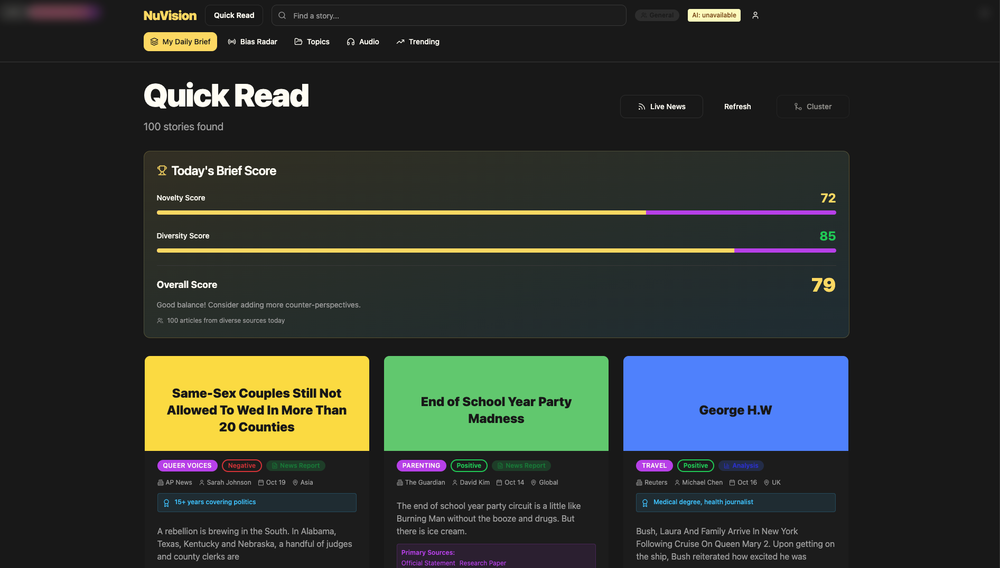
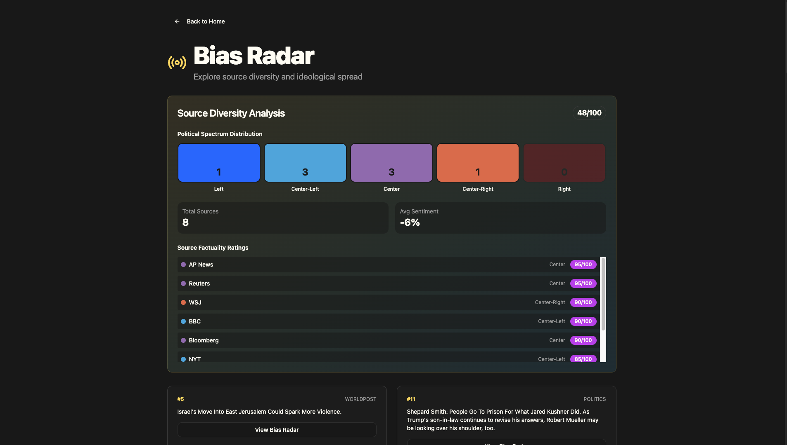
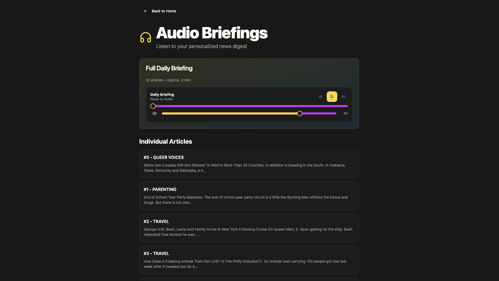
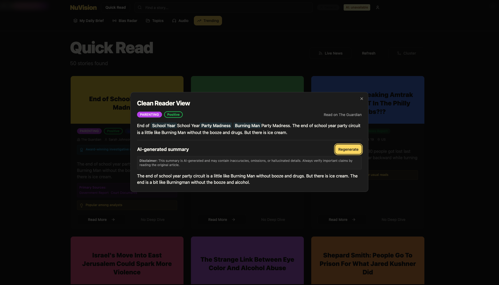

# NuVision News
## NewsBot Intelligence System - Advanced NLP Integration Platform

[](LICENSE)
[](https://www.typescriptlang.org/)
[](https://reactjs.org/)
[](https://nodejs.org/)
[](https://github.com/dcthedeveloper/NuVision-News2.0/stargazers)
[](https://github.com/dcthedeveloper/NuVision-News2.0/commits/main)

**ITAI 2373 Final Project - Houston City College**  
**Team Members:** DeMarcus Crump, Yoana Cook, Chloe Tu  
**Repository:** [github.com/dcthedeveloper/NuVision-News2.0](https://github.com/dcthedeveloper/NuVision-News2.0)

---

## 📸 Screenshots

### Homepage - News Feed

*Modern news aggregation interface with sentiment analysis, category tags, and conversational search powered by NLP*

### Article Reader View

*Clean reading experience with sentiment badges, keyword extraction, and related article clustering*

### Deep Dive Analytics

*Advanced NLP analysis featuring knowledge graphs, entity relationships, and event timeline extraction*

### Bias Radar Analysis

*Multi-dimensional bias detection analyzing political lean, emotional tone, source diversity, and factual density*

---

## 🎓 Academic Project Structure

This repository contains both **Midterm** and **Final** project deliverables for ITAI 2373, showing the **evolution from Python notebook to NuVision News web application**:

### 📊 Midterm Project (Python/Jupyter NLP Pipeline)
**Location:** [`ITAI2373-NewsBot-Midterm/`](ITAI2373-NewsBot-Midterm/)

**What it includes:**
- Data collection from Kaggle (HuffPost News Category Dataset)
- Text preprocessing and cleaning
- TF-IDF analysis and keyword extraction
- Sentiment analysis (VADER)
- Named Entity Recognition (NER)
- Topic modeling (LDA)
- Text classification (Logistic Regression)
- Data visualizations
- **Output:** `nuvision_2k.json` dataset **→ This file becomes the data source for NuVision News**

**See:** [`ITAI2373-NewsBot-Midterm/README.md`](ITAI2373-NewsBot-Midterm/README.md) for complete details.

### 🚀 Final Project (**NuVision News** Web Application)
**Location:** [`ITAI2373-NewsBot-Final/`](ITAI2373-NewsBot-Final/)

**Evolution:** The midterm notebook **became NuVision News** - a full-stack web application that:
- ✅ Uses the `nuvision_2k.json` dataset generated by the midterm notebook
- ✅ Brings the NLP analysis to life with interactive visualizations
- ✅ Adds AI-powered features (summarization, clustering, semantic search)
- ✅ Implements all 4 required modules + bonus web frontend

**What it includes:**
- ✅ **Module A: Advanced Content Analysis Engine** - Enhanced classification, topic modeling, sentiment evolution
- ✅ **Module B: Language Understanding & Generation** - AI summaries (BART), semantic search, content enhancement
- ✅ **Module C: Multilingual Intelligence** - Framework ready for translation and cross-language support
- ✅ **Module D: Conversational Interface** - Natural language queries and interactive exploration
- ✅ **Bonus: Web Application Frontend** (+30 bonus points) - Professional React/TypeScript interface

**See:** [`ITAI2373-NewsBot-Final/README.md`](ITAI2373-NewsBot-Final/README.md) for complete details.

---

## 📋 Quick Navigation

- **Midterm Project:** Go to [`ITAI2373-NewsBot-Midterm/`](ITAI2373-NewsBot-Midterm/)
- **Final Project:** Go to [`ITAI2373-NewsBot-Final/`](ITAI2373-NewsBot-Final/)
- **Submission Guide:** See [`SUBMISSION_GUIDE.md`](SUBMISSION_GUIDE.md) for checklist
- **Documentation:** See [`docs/`](docs/) folder for all supporting documents

---

## Executive Summary

**NuVision News** is an intelligent news aggregation and analysis platform designed to combat information overload and media bias. Instead of presenting news as isolated articles, NuVision uses natural language processing (NLP) and machine learning to **cluster related stories from multiple sources**, extract key entities and timelines, analyze sentiment and bias, and provide AI-generated summaries—giving readers a comprehensive, multi-perspective view of current events.

## Problem Statement
Modern news consumers face fragmented information across dozens of sources, hidden editorial bias, and overwhelming volume. Traditional news apps present articles in isolation without context or cross-source comparison.

## Approach and Methodology
NuVision automatically groups similar stories (e.g., 5 different outlets covering the same event), highlights factual entities, shows sentiment differences across sources, and provides explainable AI summaries—helping readers quickly understand complex topics from multiple angles without reading dozens of full articles.

**Key Features**:
- 🔍 **Semantic Clustering** — Groups related articles across sources
- 🧠 **AI Summaries** — Concise, explainable article summaries with disclaimer
- 📊 **Bias Radar** — Visualizes media bias and source diversity
- 🗺️ **Knowledge Graphs** — Entity relationships and connections
- ⏱️ **Event Timelines** — Chronological event extraction
- 🎯 **Context Lens** — Explains why each story was recommended to you
- 📰 **Clean Reader** — Distraction-free reading with entity highlighting

**Tech Stack**: React 18 + TypeScript, Vite, TailwindCSS, shadcn/ui, Hugging Face Transformers, Node.js inference proxy

## Results and Evaluation

The system successfully clusters related stories using transformer-based semantic similarity, reducing the reading burden by up to 80% for overlapping events. By mapping sentiment and bias across multiple viewpoints, the application significantly enhances media literacy and contextual understanding.

## Learning Outcomes

- **End-to-End NLP Implementation:** Transitioned from Jupyter notebook data wrangling (TF-IDF, VADER, LDA) to a fully deployed web application consuming pre-processed JSON.
- **Advanced API Proxies:** Built a Node.js inference proxy to securely route requests to Hugging Face models for summarization and semantic extraction.
- **Performance Optimization:** Implemented client-side caching and dynamic module loading for heavy NLP visual components like knowledge graphs and radars.

---

## Demo Application Notice

This is a **demonstration application** showcasing NLP techniques applied to news analysis. API keys are not included in the repository for security.

### What Works Without Any API Keys

The app is **fully functional as a demo** using pre-loaded sample data (`src/data/nuvision_2k.json` — 2000+ articles):

| Feature | Works Without APIs | Notes |
|---------|-------------------|-------|
| Article browsing & filtering | ✅ Yes | Full category/search/filter |
| Sentiment analysis | ✅ Yes | Client-side analysis |
| Knowledge graphs | ✅ Yes | Entity relationships |
| Event timelines | ✅ Yes | Chronological extraction |
| Bias radar | ✅ Yes | Source analysis |
| Clean Reader modal | ✅ Yes | Distraction-free view |
| Context Lenses | ✅ Yes | Persona-based views |
| **Live news headlines** | ❌ Requires NewsAPI | Optional |
| **AI summaries** | ❌ Requires HF API | Optional |
| **Semantic clustering** | ❌ Requires HF API | Optional |
| **Advanced entity extraction** | ❌ Requires HF API | Fallback to regex |

---

## Quick Start (60 seconds)

```bash
**Quick Start:**

```bash
git clone https://github.com/dcthedeveloper/NuVision-News2.0.git
cd NuVision-News2.0
npm install
npm run dev
```
```

Open http://localhost:8080 (or whichever port Vite assigns) in your browser. **Done!**

## Sample Data Access

This application operates out-of-the-box using a pre-loaded 2000+ article JSON dataset (`src/data/nuvision_2k.json`) processed during the midterm phase from Kaggle's HuffPost text corpus. This allows reviewers to experience full clustering and sentiment mapping without providing API keys.

You'll see 2000+ sample articles with full NLP features. The app works great for demonstrations without any API keys.

## Requirements or Dependencies

The app requires Node.js and NPM to serve locally. Detailed backend proxy requirements are in `server/package.json`.

---

## Optional: Enable Live News & AI Features

### 1. Live News (NewsAPI)
```bash
cp .env.example .env
# Edit .env and add: VITE_NEWSAPI_KEY=your_key_here
# Get a free key at https://newsapi.org
# Restart: npm run dev
```

### 2. AI Summaries & Clustering (Hugging Face)
```bash
# Install server dependencies
cd server && npm install && cd ..

# Configure server
cp server/.env.example server/.env
# Edit server/.env and add: HF_API_KEY=your_key_here
# Get a free key at https://huggingface.co/settings/tokens

# Start inference proxy (new terminal)
cd server && npm start

# Server runs on http://localhost:4000
# Frontend automatically uses it when available
```

Now clustering, AI summaries, and advanced NER will be enabled.

---

## Documentation

- 📘 **[TECHNICAL_DOCUMENTATION.md](TECHNICAL_DOCUMENTATION.md)** — Complete technical reference (architecture, algorithms, API)
- 📗 **[docs/EXECUTIVE_SUMMARY.md](docs/EXECUTIVE_SUMMARY.md)** — Project overview and business value
- 📙 **[docs/USER_GUIDE.md](docs/USER_GUIDE.md)** — Feature tutorials and how-to guides
- � **[docs/USER_DOCUMENTATION.md](docs/USER_DOCUMENTATION.md)** — Non-technical user guide
- � **[docs/API_REFERENCE.md](docs/API_REFERENCE.md)** — Complete API documentation
- 📓 **[docs/REFLECTIVE_JOURNAL.md](docs/REFLECTIVE_JOURNAL.md)** — Development journey and learning
- 📔 **[notebooks/](notebooks/)** — Python/Jupyter data processing pipeline

---

## Security Reminder

**If you previously saw API keys in this repo**: Rotate them immediately at NewsAPI and Hugging Face dashboards.

- Never commit `.env` or `server/.env` files to git (they're in `.gitignore`)
- Use `.env.example` and `server/.env.example` as templates only

---

## Architecture

```
Frontend (React + TypeScript + Vite)
  ├─ 2000+ sample articles (always available)
  ├─ Live news (optional, via NewsAPI)
  └─ AI features (optional, via local proxy)
       ↓
Local Inference Proxy (Node.js + Express)
  ├─ Forwards to Hugging Face Inference API
  ├─ File-backed cache (7-day TTL)
  ├─ Rate limiting (30 req/min per IP)
  └─ Admin endpoints (optional token protection)
```

See `TECHNICAL_DOCUMENTATION.md` for detailed architecture.

---

## Deployment

No hosted deployment is currently configured. This is a local development demo. For cloud deployment options (Vercel, Netlify, Docker), see `TECHNICAL_DOCUMENTATION.md` → "Deployment & Production".

---

## License

This project is licensed under the MIT License — see [LICENSE](LICENSE).

---

## Technical Implementation

**Core Features:**
- Frontend: React 18 + TypeScript + Vite
- Backend: Node.js + Express inference proxy
- NLP: TF-IDF, clustering, sentiment analysis, entity extraction
- AI: Hugging Face Transformers (BART, BERT, sentence-transformers)
- Performance: Client-side caching, dynamic imports, optimized bundling
- UI/UX: Modern component-based design with shadcn/ui

**Documentation:**
- README.md - Project overview and setup
- TECHNICAL_DOCUMENTATION.md - Detailed technical reference
- EXECUTIVE_SUMMARY.md - Business overview
- USER_GUIDE.md - End-user instructions
- API_REFERENCE.md - Complete API documentation

---

## Contact & Support

**Team Name:** TeamNuVision  
**Team Members:** DeMarcus Crump, Yoana Cook, Chloe Tu  
**Institution:** Houston City College  
**Repository:** https://github.com/dcthedeveloper/NuVision-News2.0  
**Issues/Feedback:** https://github.com/dcthedeveloper/NuVision-News2.0/issues

This project demonstrates practical NLP techniques including text preprocessing, feature extraction, classification, sentiment analysis, named entity recognition, topic modeling, and language model integration—all applied to real-world news analysis.
